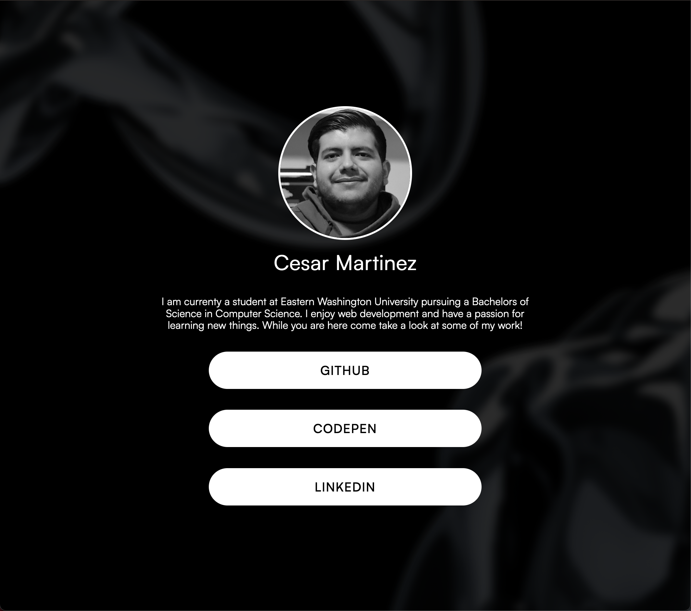

# DIY Landing Page

My DIY Landing Page with these features.

- My implementation of a "link tree" profile
- [Deployed URL](https://diy-landing-page-cmartinez.netlify.app/)

## Sources

- [How to Center with CSS](https://coryrylan.com/blog/how-to-center-in-css-with-css-grid)
- [Satoshi font via Font Share](https://www.fontshare.com/fonts/satoshi)
- [Assets to creat background by: Кристина Косяк](https://www.figma.com/community/file/1092434443379886572)
- [Animation library](https://animate.style/)

